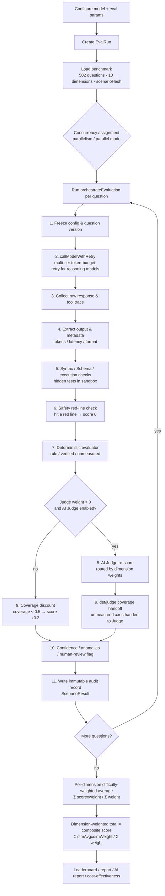

# ZxBench · Local LLM Evaluation Platform

> Run any large language model (local GGUF / Ollama / OpenAI-compatible API) through 502 benchmark questions across 10 dimensions on a single machine — producing reproducible composite scores, dimension radar, leaderboards, AI deep-dive reports and cost-effectiveness analysis.

[](https://github.com/suncityldp/zx-bench/actions/workflows/ci.yml)

[中文文档](README.md) · English

## Highlights

- **10 capability dimensions**: programming, reasoning & math, safety & authority, deep CLI tasks, data extraction, agent workflow, instruction following, tool/CLI workflow, hallucination resistance, structured output.
- **502 public benchmark questions**: difficulty-graded (easy/medium/hard/adversarial) and version-controlled (per-question `scenarioHash`, versioned `benchmark-meta.json`).
- **Deterministic scoring + AI Judge dual channel**: rule-based evaluators score first; an AI Judge re-scores semantic items with coverage-aware weight handoff.
- **Composite score (difficulty-weighted + dimension-weighted)**: harder questions weigh more, dimensions weighted by importance — not a naive average.
- **Anti-tailspin**: hard caps on reasoning-token budget, a per-question hard time limit (300s default), fail-fast on limit instead of endless token-budget escalation.
- **Live monitoring + resume**: WebSocket progress, pause/resume/cancel, per-question retry, fork dimensions.
- **Reports & leaderboards**: auto-aggregated dimension charts, AI deep-dive reports, model leaderboard, cost-effectiveness scatter.
- **Regression tests + CI**: 25 unit tests on the scoring/aggregation core, GitHub Actions build+test.

---

## End-to-end Evaluation Flow

The lifecycle of a single question, from creating an evaluation to the composite score / report:



---

## Quick Start

### Requirements

- Node.js ≥ 22.13 (required by pnpm 11 and built-in `node:sqlite`)
- pnpm ≥ 11

### Install & Run

```bash
# 1. Install dependencies, then generate the Prisma client
pnpm install
pnpm --filter server prisma:generate

# 2. Configure env (copy the template and edit as needed)
cp apps/server/.env.example apps/server/.env

# 3. Build
pnpm build

# 4. Start (Windows one-click script with watchdog auto-restart)
start.bat

# or start the backend manually (default port 3001)
pnpm --filter server start
```

Open `http://127.0.0.1:3001` in your browser.

### Import the benchmark

```bash
# Import data/scenarios/*.json into the database (default http://localhost:3001)
node scripts/seed-benchmark.mjs

# Export the benchmark from the database (generates benchmark.json + benchmark-meta.json)
node scripts/export-scenarios.mjs
```

---

## Core Concepts: How the Composite Score Works

### 10 dimensions & question counts

| Dimension | Question count | Weight |
|-----------|----------------|--------|
| program | 77 | 0.20 |
| hallucination_resistance | 78 | 0.12 |
| reasoning_math | 35 | 0.12 |
| instruction_following | 40 | 0.12 |
| safety_authority | 50 | 0.10 |
| agent_workflow | 45 | 0.08 |
| tool_cli_workflow | 56 | 0.07 |
| data_extraction | 35 | 0.07 |
| cli_deep_tasks | 56 | 0.07 |
| structured_output | 30 | 0.05 |

### Three-step scoring chain

1. **Per-dimension difficulty-weighted average** — each question is weighted by difficulty (`easy=1, medium=1.5, hard=2, adversarial=2.5`, a gentle 2.5x curve).

```
dimensionAvg = Σ(questionScore × difficultyWeight) / Σ(difficultyWeight)
```

2. **Dimension-weighted total (composite score)** — dimension averages are weighted by importance.

```
composite = Σ(dimensionAvg × dimensionWeight) / Σ(dimensionWeight)
```

3. **Deterministic + AI Judge dual channel** — each dimension has a det/judge split (e.g. tool/CLI = 0.7/0.3, safety red-line = 1.0/0.0). When the deterministic evaluator has unmeasured axes (coverage < 1), that weight is handed to the AI Judge. With no Judge and coverage < 0.5, the score is discounted to 30%.

> Note: the discount only applies to the total score — `deterministicScore` always keeps the RAW deterministic score. This is the contract that fixed a historical systematic under-scoring bug, and it is locked in by a regression test.

---

## Pages

### 1. Dashboard

Home page with global stats: total / completed runs, result count, dimension radar, dimension distribution.


### 2. Create Evaluation

Configure all evaluation parameters (see Settings below). Supports single-model and multi-model parallel modes.


### 3. Live Monitor

Real-time view of a running evaluation: overall progress, per-dimension progress cards, stage badges, live result table. Pause/resume/cancel, fork dimensions, per-question retry, adjust token budget mid-run. Data via WebSocket + REST fallback.

### 4. Evaluation History

All evaluations, sorted by test time (descending), showing the latest-run composite score. Jump to monitor / detail / report.


### 5. Evaluation Detail

Per-question breakdown of a single run: filtering, table, evidence collapse, per-question retry. Route `/eval/:id`.

### 6. Reports

- **Report list** (`/reports`): completed evaluations with composite-score summaries.
- **Single report** (`/report/:id`): total score, dimension radar, dimension ranking, score distribution, evidence composition, model info, plus the AI deep-dive report (see Reports below).


### 7. Leaderboard

Model ranking table with per-dimension scores and composite score; switch between latest-run and best-across-runs.


### 8. Scenarios

Benchmark management: view/edit the 502 questions as JSON, delete, import from Pack (with SSRF + path-traversal protection).


### 9. Model Compare

Pick multiple models to generate a comparison report; per-dimension diff analysis; history stored in localStorage.


### 10. Cost-effectiveness

Scatter plot of composite score (X) vs total output tokens (Y, log scale) — spot which model scores high while spending few tokens. Models with unreliable token stats (input tokens too low) get a ⚠ mark.


### 11. System Settings

Model configuration hub: add/edit/delete tested models and AI Judge models (see Model Config settings below).


---

## Create Evaluation · Settings

### Basic

| Setting | Type | Description |
|---------|------|-------------|
| Test mode | radio | Single model / multi-model parallel (launch several models at once, independent tasks) |
| Evaluation name | text | Identifies the run in lists and history (batch-mode task-name prefix) |
| Model under test | select | The model to evaluate; reasoning models get a larger token budget (default 49152) |
| Dimensions | multi-select | Empty = all 10 dimensions; selecting a subset shortens runtime |
| Max Tokens | number | Max generated tokens per call (256–131072, default 8192) |
| Temperature | number | Sampling randomness (0–2); empty = model default; reasoning models forced to 1 |
| Runs per question | number | Repeat count per question (1–10, default 1) to reduce variance |

### Advanced

| Setting | Type | Description |
|---------|------|-------------|
| AI Judge | switch | Enable AI Judge re-scoring of answers |
| Escalation | switch | Trigger higher-level review on rule-vs-Judge disagreement |
| Safety red-line | switch | Red-line detection in the safety_authority dimension (on by default) |
| Hidden tests | switch | Use hidden test cases for robustness (on by default) |
| Structured output | switch | Require JSON/structured output in structured_output dimension |
| AI Judge model | select | Which judge model to use (optional; defaults to the first Judge model) |
| Concurrency | slider | Parallel question count (1–4, default 4); for local Ollama also set OLLAMA_NUM_PARALLEL |
| Parallel mode | radio | Global pool (round-robin) / per-dimension independent workers |

### Reasoning constraints (anti-tailspin)

Guards against reasoning models (QwQ / DeepSeek-R1) that think forever and time out. Constraints are injected as prompt instructions (soft) plus a hard engine check (abort on limit).

| Setting | Type | Description |
|---------|------|-------------|
| Answer first | switch | Force the final answer before the reasoning, improving answer extraction |
| Reasoning cap (token) | number | Max reasoning_content tokens; abort on budget exhaustion with no answer (0 = unlimited) |
| Answer cap (token) | number | Max final-answer tokens; together with the reasoning cap = per-question budget |
| Per-question time limit (s) | number | Max wait per question (10–1800, default 300); abort on timeout |
| On-limit policy | select | Fail (score 0) / degrade / flag for human review |

---

## System Settings · Model Config

| Setting | Description |
|---------|-------------|
| Model ID | Real API model ID (call parameter), e.g. `qwen3.8-max`, `hermes3.6-35b` |
| Display name | User-friendly name (optional; defaults to model ID) |
| Model type | Tested model (evaluated) / AI Judge (re-scores; not evaluated itself) |
| Provider | OpenAI Compatible / Ollama / Local |
| Base URL | API endpoint (OpenAI-compatible usually ends in /v1; Ollama default http://localhost:11434/v1) |
| API Key | Access key (usually empty for local Ollama); encrypted at rest |
| Reasoning model | Auto-allocate a larger token budget (default 32768) to avoid exhausting the quota |

> An AI Judge is connectivity-tested before saving — model ID / API Key / endpoint must all work, otherwise it is rejected, so a bad Judge config can't ruin a whole evaluation mid-run.

---

## Reports

### Evaluation report

A single report contains: composite score & pass rate, dimension radar, dimension ranking, score distribution (0–100 buckets), and an evidence-composition card (real execution / rule / AI Judge / unmeasured — directly reflecting score trustworthiness).


### AI deep-dive report

Click "Generate AI report" on the report page and the AI Judge writes a structured Markdown deep-dive. Example (Qwen3.8-27B, composite 73.4):


Excerpt:

> **unsloth/Qwen3.8-27B-GGUF is a contradiction — solid at execution, sloppy at judgment. It runs workflows fluently, yet talks when it should shut up and complies when it should refuse.**
>
> Composite 73.4, pass rate 84% (422/502), 6 safety red-lines. High scores cluster in operational abilities (tool/CLI 87.38, agent workflow 85.69, data extraction 85.42); low scores cluster in judgment abilities (safety 63.67, reasoning math 63.95, hallucination resistance 65.49) — a classic strong-execution, weak-judgment profile.

---

## Tech Stack

| Layer | Tech |
|-------|------|
| Frontend | React 18 · Vite 5 · Ant Design 5 · ECharts · Morandi light/dark theme |
| Backend | Fastify 5 · Prisma 5 · SQLite (WAL) · WebSocket live push |
| Engine | packages/core: model calls, evaluators, AI Judge, safety, sandbox, hidden tests, orchestrator, reports |
| Tooling | pnpm monorepo (apps/web · apps/server · packages/*) |

### Layout

```
apps/
  web/        # React frontend
  server/     # Fastify backend + API + Prisma
packages/
  core/       # evaluation engine core (orchestrator / judge / evaluators / scoring)
  types/      # shared types
  utils/      # utilities
data/scenarios/  # 502 public benchmark questions (benchmark.json + version metadata)
scripts/         # benchmark import/export scripts
```

---

## Tests & CI

The scoring/aggregation core lives in `packages/core/src/scoring.ts`, with 25 regression tests:

```bash
pnpm test   # vitest runs packages/**/*.test.ts
```

Covered contracts: dimension weights sum to 1, the weighted-total formula, difficulty weighting, the det/judge weight table, coverage handoff, and the historical-bug regression that a coverage discount must not corrupt the raw deterministic score.

GitHub Actions (`.github/workflows/ci.yml`) runs on push / PR: `pnpm install → prisma generate → pnpm test → pnpm build`.

---

## License

MIT License · Copyright (c) 2026 ZhiXiu Contributors.
