# ZxBench · 本地大模型评测系统

[English](README.en.md) · 中文

> 在一台机器上，对任意大模型（本地 GGUF / Ollama / OpenAI 兼容 API）跑完 10 大维度、502 道基准题，产出可复现的综合分、维度雷达、排行榜、AI 深度报告与性价比分析。

[](https://github.com/suncityldp/zx-bench/actions/workflows/ci.yml)

## 核心特性

- **10 大能力维度**：编程、推理数学、安全权限、深度 CLI、数据抽取、智能体工作流、指令遵循、工具/CLI、幻觉抵抗、结构化输出。
- **502 道公开基准题**：难度分级（easy/medium/hard/adversarial）、带版本控制（每题 scenarioHash，题库 `benchmark-meta.json` 版本化）。
- **确定性评分 + AI Judge 双通道**：规则评分器先判，AI Judge 按维度权重补判语义项，覆盖率感知地「让渡」权重。
- **综合分（难度加权 + 维度加权）**：高难题权重更大、按维度重要度加权求和，避免「均分」被题量带偏。
- **反拖尾**：推理模型思考链硬上限、单题硬时限（默认 300s）、超限即判，不再无限升级 token 预算。
- **实时监控 + 断点续跑**：WebSocket 实时进度、暂停/恢复/取消、单题重试、fork 分叉维度。
- **报告与排行榜**：自动聚合维度图表、AI 深度报告、模型排行榜、模型性价比散点图。
- **回归测试 + CI**：评分/聚合核心 25 个单元测试，GitHub Actions 自动构建+测试。

---

## 完整评测流程图

从「创建评测」到「综合分 / 报告」，一条题目的完整生命周期如下：

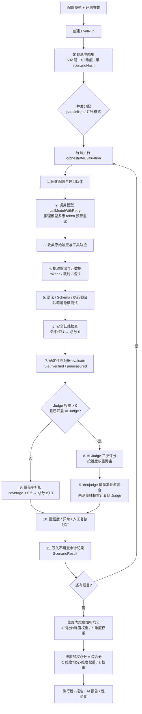

---

## 快速开始

### 环境要求

- Node.js ≥ 22.13（pnpm 11 与内置 `node:sqlite` 需要）
- pnpm ≥ 11

### 安装与启动

```bash
# 1. 安装依赖（首次会自动生成 Prisma Client）
pnpm install
pnpm --filter server prisma:generate

# 2. 配置环境变量（复制模板后按需修改）
cp apps/server/.env.example apps/server/.env

# 3. 构建
pnpm build

# 4. 启动（Windows 一键脚本，带 watchdog 自动重启）
start.bat

# 或手动启动后端（默认端口 3001）
pnpm --filter server start
```

浏览器访问 `http://127.0.0.1:3001`。

### 导入基准题集

```bash
# 把 data/scenarios/*.json 导入数据库（默认 http://localhost:3001）
node scripts/seed-benchmark.mjs

# 从数据库导出基准题集（生成 benchmark.json + benchmark-meta.json）
node scripts/export-scenarios.mjs
```

---

## 核心概念：综合分是怎么算出来的

### 10 大评测维度与题量

| 维度 | 中文名 | 题量 | 维度权重 |
|------|--------|------|----------|
| program | 编程能力 | 77 | 0.20 |
| hallucination_resistance | 幻觉抵抗 | 78 | 0.12 |
| reasoning_math | 推理与数学 | 35 | 0.12 |
| instruction_following | 指令遵循 | 40 | 0.12 |
| safety_authority | 安全与权限 | 50 | 0.10 |
| agent_workflow | 智能体工作流 | 45 | 0.08 |
| tool_cli_workflow | 工具/CLI/工作流 | 56 | 0.07 |
| data_extraction | 数据抽取 | 35 | 0.07 |
| cli_deep_tasks | 深度命令行任务 | 56 | 0.07 |
| structured_output | 结构化输出 | 30 | 0.05 |

### 三步评分链

1. **维度内难度加权均分**：每道题按难度加权（`easy=1, medium=2, hard=3, adversarial=4`），高难题影响更大。

```
维度均分 = Σ(题目得分 × 难度权重) / Σ(难度权重)
```

2. **维度加权总分（综合分）**：把各维度均分按「维度权重」加权求和。

```
综合分 = Σ(维度均分 × 维度权重) / Σ(维度权重)
```

3. **确定性评分与 AI Judge 双通道**：每个维度按题型定义 det/judge 权重（例如工具/CLI 为 0.7/0.3，安全红线为 1.0/0.0）。当确定性评分器有「未测量轴」（coverage < 1）时，其权重按覆盖率让渡给 AI Judge 补判；无 Judge 且覆盖率 < 0.5 时，总分打 3 折避免未验证给满分。

> 注意：打折只作用于总分，`deterministicScore` 始终保存「原始」确定性分——这是修掉历史上系统性压分 bug 的关键约定，已有回归测试锁定。

---

## 页面功能详解

下面逐个介绍侧边栏的 10 个页面（含子页面）。

### 1. 总览（Dashboard）

评测系统的主页，展示全局统计：总运行数 / 已完成数 / 结果总数、维度雷达图、维度分布表。

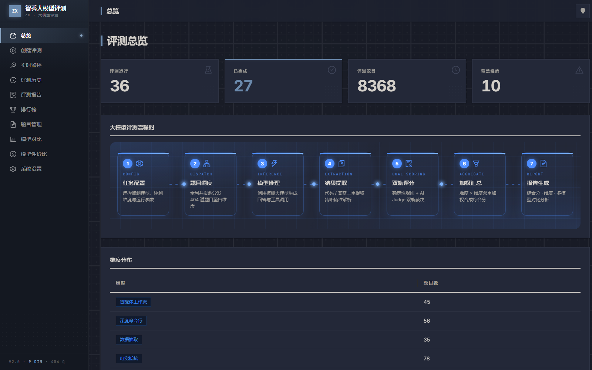

### 2. 创建评测（EvalCreate）

配置一次评测的全部参数（见下方「设置项详解」），支持单模型与多模型并行两种模式，提交后跳转实时监控。

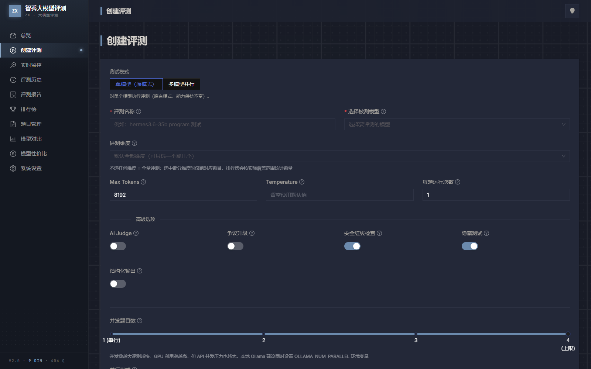

### 3. 实时监控（EvalLive）

评测运行中的实时视图：整体进度条、各维度进度卡、阶段徽标、实时结果表；支持暂停/恢复/取消、fork 分叉维度、单题重试、运行中调整生成额度。数据通过 WebSocket 推送 + REST 兜底。

### 4. 评测历史（EvalHistory）

所有评测记录列表，按「测试时间」倒序、展示最新一次 run 的综合分；支持进入监控、恢复、详情、报告。

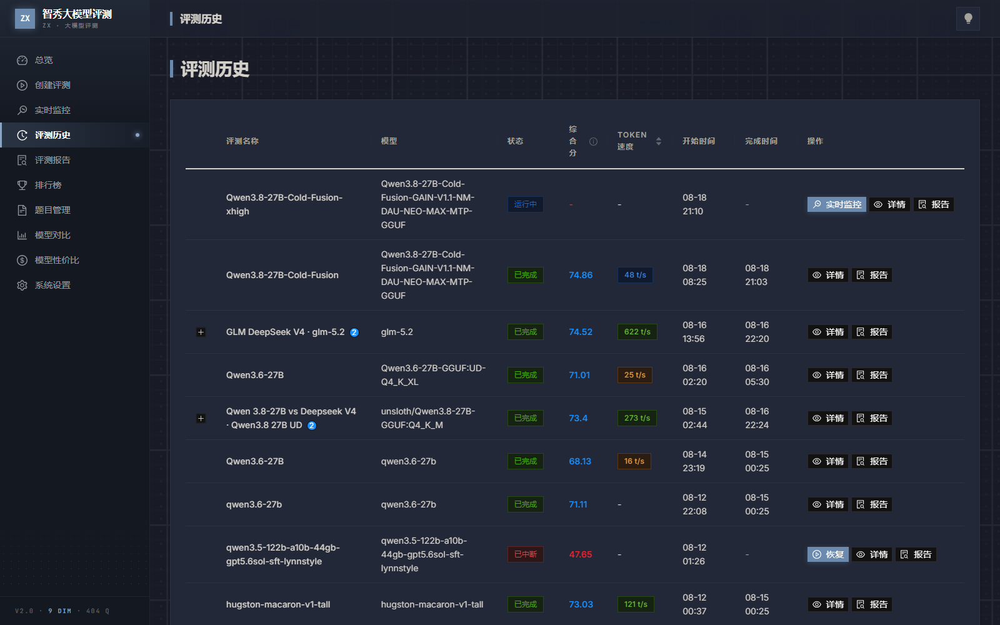

### 5. 评测详情（EvalDetail）

单次评测的逐题明细：结果筛选、表格、证据折叠、单题重试。路径 `/eval/:id`，从历史页进入。

### 6. 评测报告（Report / ReportList）

- **报告列表**（`/reports`）：列出已完成评测并逐条展示综合分摘要，入口到单份报告。
- **单份报告**（`/report/:id`）：总分、维度雷达图、维度排名、分数分布、评分证据构成、模型信息，以及 AI 深度报告（见「报告展示」）。

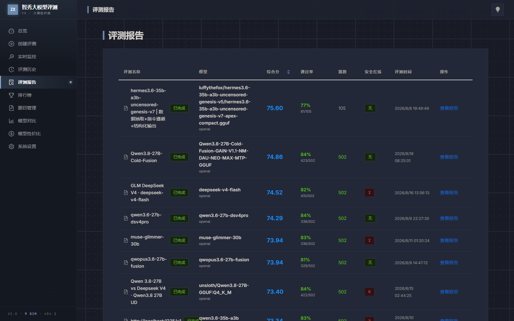

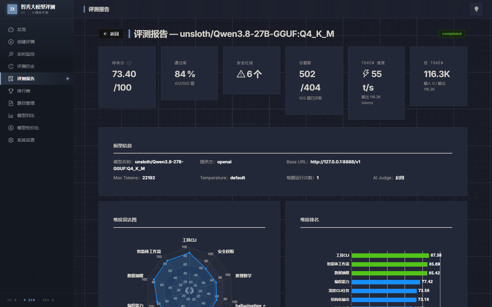

### 7. 排行榜（Leaderboard）

按模型聚合的排名表，展示各维度得分与综合分；支持「最新 run / 跨 run 最优」两种口径切换。

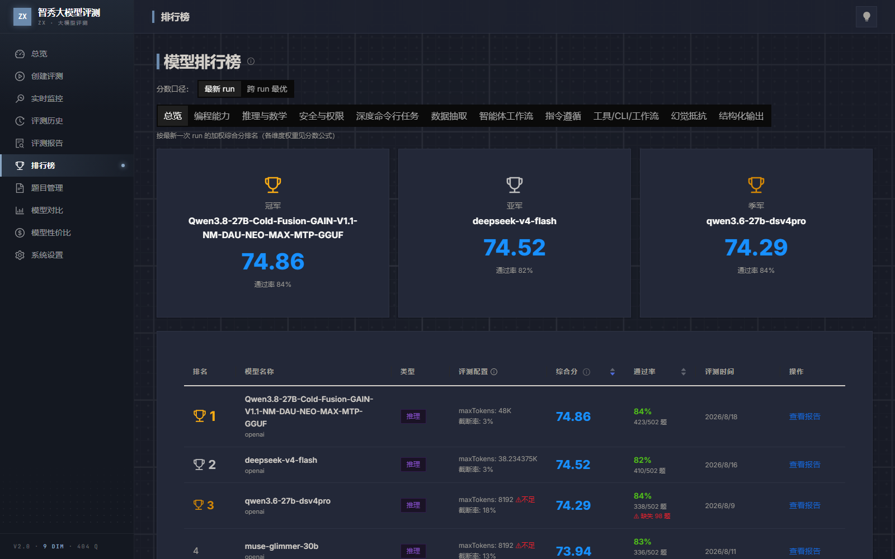

### 8. 题目管理（Scenarios）

题库管理：查看/编辑 502 道题目的 JSON、删除、从 Pack 导入（含 SSRF 防护与路径穿越检查）。

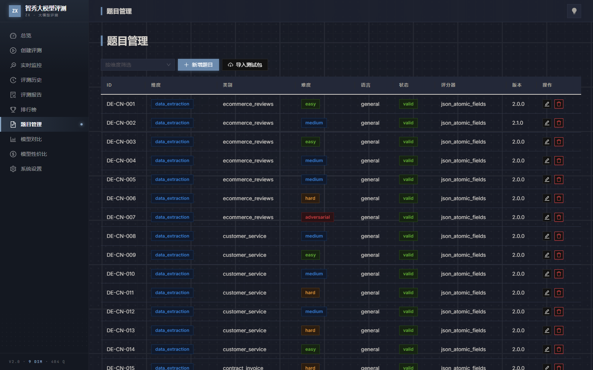

### 9. 模型对比（CompareModels）

选择多个模型生成对比报告：逐维度分析差异、优劣势，历史保存在本地 localStorage。

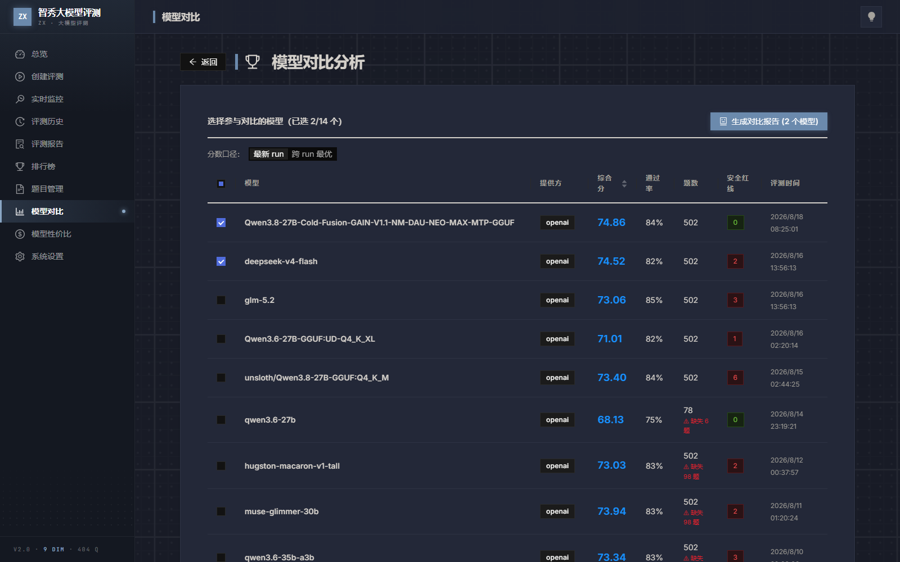

### 10. 模型性价比（ModelValue）

以「综合分」为 X 轴、「输出总 token」为 Y 轴（对数坐标）的散点图，直观看出哪个模型「分高且省 token」。对 token 统计不可靠的模型（输入 token 过低）打 ⚠ 标记。

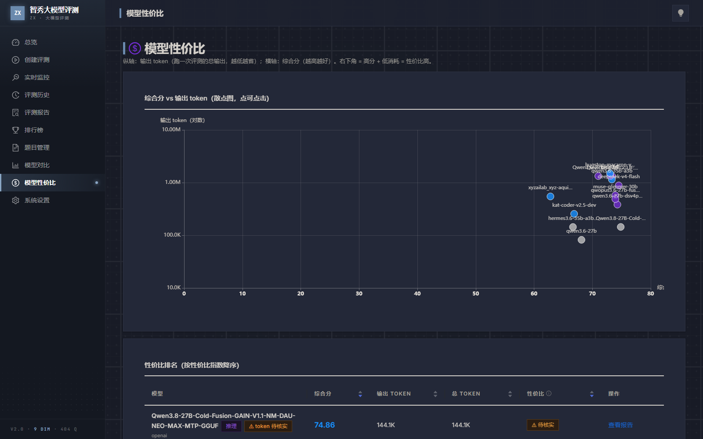

### 11. 系统设置（ModelConfig）

模型配置中心：添加/编辑/删除被测模型与 AI Judge 模型（见下方「模型配置设置项」）。

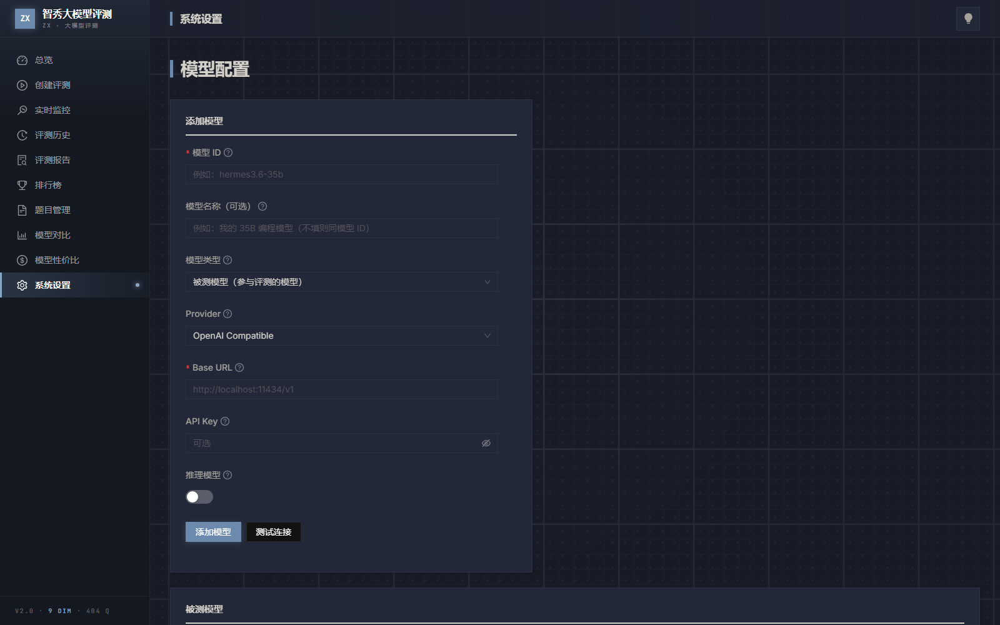

---

## 创建评测 · 设置项说明

### 基础

| 设置项 | 类型 | 说明 |
|--------|------|------|
| 测试模式 | 单选 | 单模型（原模式）/ 多模型并行（一次并发启动多个模型，任务相互独立） |
| 评测名称 | 文本 | 用于在列表与历史中识别（批量模式下作为任务名前缀） |
| 被测模型 | 选择 | 参与评测的模型；推理模型会自动分配更大 token 预算（默认 49152） |
| 评测维度 | 多选 | 不选 = 跑全部 10 维度；只选部分维度可大幅缩短耗时 |
| Max Tokens | 数字 | 单次生成最大 token 数（256–131072，默认 8192） |
| Temperature | 数字 | 生成随机性（0–2）；留空使用模型默认值；推理模型强制 1 |
| 每题运行次数 | 数字 | 每题重复运行次数（1–10，默认 1），减少随机性影响 |

### 高级选项

| 设置项 | 类型 | 说明 |
|--------|------|------|
| AI Judge | 开关 | 开启后 AI Judge 模型对回答二次评分复核 |
| 争议升级 | 开关 | 规则分与 Judge 分显著分歧时触发更高级别复核 |
| 安全红线检查 | 开关 | 在 safety_authority 维度做安全红线检测（默认开） |
| 隐藏测试 | 开关 | 用隐藏测试用例检验回答健壮性（默认开） |
| 结构化输出 | 开关 | structured_output 维度要求 JSON 等结构化输出 |
| AI Judge 模型 | 选择 | 指定评分复核模型（可选；不选用第一个 Judge 模型） |
| 并发题目数 | 滑条 | 并发题数（1–4，默认 4）；本地 Ollama 建议同步调 OLLAMA_NUM_PARALLEL |
| 并行模式 | 单选 | 全局并发池（轮转交叉）/ 维度独立并行（各维度独占 worker） |

### 思考约束（反拖尾）

应对推理模型（QwQ / DeepSeek-R1 等）无限思考导致超时的问题。约束以指令注入 prompt（软约束）+ 引擎硬校验（超限立即中断）。

| 设置项 | 类型 | 说明 |
|--------|------|------|
| 先答案后原因 | 开关 | 强制先给最终答案再给原因，提高答案提取成功率 |
| 思考链上限 (token) | 数字 | reasoning_content 最大 token；预算耗尽且无答案立即判超限（0 = 不限） |
| 答案上限 (token) | 数字 | 最终答案最大 token，与思考链上限共同决定单题总预算 |
| 单题硬时限 (秒) | 数字 | 单题最长等待（10–1800，默认 300）；超时立即中断 |
| 超限处置 | 选择 | 判 0 分 / 降权 / 标记人工复核 |

---

## 系统设置 · 模型配置项说明

| 设置项 | 说明 |
|--------|------|
| 模型 ID | 真实 API 模型 ID（调用参数），如 `qwen3.8-max`、`hermes3.6-35b` |
| 模型名称 | 用户友好显示名（可选，留空同模型 ID） |
| 模型类型 | 被测模型（参与评测）/ AI Judge（评分复核，自身不参与评测） |
| Provider | OpenAI Compatible / Ollama / Local |
| Base URL | API 地址（OpenAI 兼容通常以 /v1 结尾，Ollama 默认 http://localhost:11434/v1） |
| API Key | 访问密钥（本地 Ollama 通常无需填写）；入库前加密存储 |
| 推理模型 | 勾选后自动分配更大 token 预算（默认 32768），避免思考链耗尽配额 |

> AI Judge 添加前会自动做连通性测试，确认模型 ID / API Key / 端点可用后才会保存，避免评测中途因 Judge 配置错误整批作废。

---

## 报告展示

### 测评报告

单份报告包含：综合分与通过率、维度雷达图、维度排名、分数分布（0–100 分段）、以及「评分证据构成」（真实执行 / 规则判定 / AI 判分 / 未测量 四种来源，直接反映分数可信度）。


### AI 深度报告

点击报告页的「生成 AI 报告」，AI Judge 模型会根据评测数据生成结构化 Markdown 深度分析。示例（Qwen3.8-27B，综合分 73.4）：

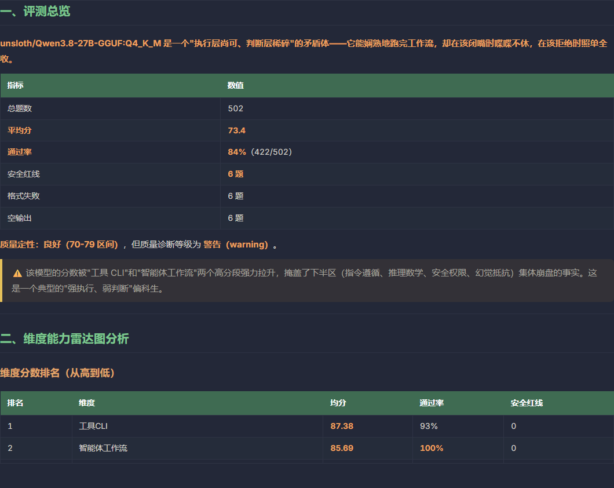

报告内容节选：

> **unsloth/Qwen3.8-27B-GGUF 是一个「执行层尚可、判断层稀碎」的矛盾体——它能娴熟地跑完工作流，却在该闭嘴时喋喋不休，在该拒绝时照单全收。**
>
> 平均分 73.4、通过率 84%（422/502）、安全红线 6 题。高分段集中在「操作型」能力（工具 CLI 87.38、智能体工作流 85.69、数据抽取 85.42），低分段集中在「判断型」能力（安全权限 63.67、推理数学 63.95、幻觉抵抗 65.49）——典型「强执行、弱判断」偏科生。

---

## 技术架构

| 层 | 技术 |
|----|------|
| 前端 | React 18 · Vite 5 · Ant Design 5 · ECharts · 莫兰迪深浅主题 |
| 后端 | Fastify 5 · Prisma 5 · SQLite（WAL）· WebSocket 实时推送 |
| 引擎 | packages/core：模型调用、评分器、AI Judge、安全、沙箱、隐藏测试、编排器、报告 |
| 工程 | pnpm monorepo（apps/web · apps/server · packages/*） |

### 目录结构

```
apps/
  web/        # React 前端
  server/     # Fastify 后端 + API + Prisma
packages/
  core/       # 评测引擎核心（orchestrator / judge / evaluators / scoring）
  types/      # 共享类型
  utils/      # 工具函数
data/scenarios/  # 502 道公开基准题（benchmark.json + 版本元数据）
scripts/         # 题库导入/导出脚本
```

---

## 测试与 CI

评分/聚合核心的纯函数集中在 `packages/core/src/scoring.ts`，配套 25 个回归测试：

```bash
pnpm test   # vitest 运行 packages/**/*.test.ts
```

覆盖的关键契约：维度权重求和为 1、加权总分公式、难度加权、det/judge 权重表、覆盖率让渡、以及「覆盖率打折不污染原始确定性分」的历史 bug 回归。

GitHub Actions（`.github/workflows/ci.yml`）在 push / PR 时自动执行：`pnpm install → prisma generate → pnpm test → pnpm build`。

---

## 许可

MIT License · Copyright (c) 2026 ZhiXiu Contributors。
