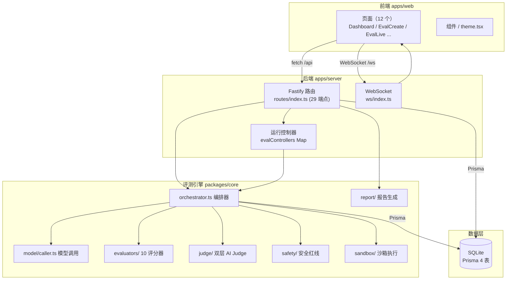
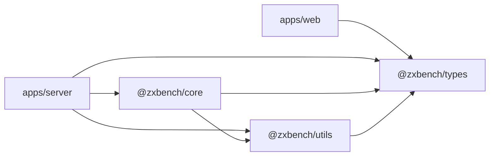

# 01 · 项目概览与整体架构

## 1. 项目定位

ZxBench Pro WebUI 是一套**本地部署的大模型能力评测系统**（Benchmark · Local）。用户配置本地/远程模型（OpenAI 兼容接口，如 LM Studio、Ollama、API 服务），从内置题库挑选维度运行评测，实时监控进度，并产出**结构化评分报告、AI 评测报告、模型排行榜与模型对比报告**。

核心特点：

- 9 维度评测体系，覆盖编程、安全、智能体、工具调用、推理、数据抽取等能力。
- 确定性评分器 + 双层 AI Judge（本地初判 → 顶级模型争议复核）裁决机制。
- 推理模型（QwQ / DeepSeek-R1）专用处理：`reasoning_content` 分离 + 多级 token 预算重试。
- 断点续跑、暂停/恢复/取消、多维度并行、fork 分叉测试。
- WebSocket 实时进度推送 + 前端重连与兄弟运行聚合。
- API Key 加密存储、SSRF / 路径穿越防护、导出脱敏。

## 2. Monorepo 结构

```text
zxbench-webui/
├── apps/
│   ├── web/          # 前端 WebUI（React SPA）
│   └── server/       # 后端服务（Fastify API + WebSocket + 静态托管 + Prisma）
├── packages/
│   ├── core/         # 评测引擎核心（评分、Judge、沙箱、报告、编排）
│   ├── types/        # 共享类型契约（前后端 + 引擎共同使用）
│   └── utils/        # 通用工具（ID、哈希、统计、截断、参数化）
├── data/scenarios/   # 静态题库 JSON（seed 脚本数据源）
├── scripts/          # 数据修复 / 分析辅助脚本（Python + MJS 混合）
├── ppt/              # 演示材料
├── prisma/           # （位于 apps/server 内）
├── pnpm-workspace.yaml
└── package.json      # 根脚本编排
```

工作区声明见 [pnpm-workspace.yaml](../../pnpm-workspace.yaml)。

## 3. 技术栈

### 前端（apps/web）

| 领域 | 技术 |
| --- | --- |
| 框架 | React 18、React DOM 18 |
| 构建 | Vite 5 + @vitejs/plugin-react |
| 路由 | React Router 6（BrowserRouter） |
| UI 组件库 | Ant Design 5 + @ant-design/icons |
| 图表 | ECharts 5 + echarts-for-react |
| 主题 | 自研 Context（浅/深色莫兰迪主题，localStorage 持久化） |

### 后端（apps/server）

| 领域 | 技术 |
| --- | --- |
| HTTP 框架 | Fastify 5 |
| 插件 | @fastify/cors、@fastify/static、@fastify/websocket |
| 数据层 | Prisma 5 + SQLite（启动时启用 WAL 模式） |
| 日志 | Pino + pino-pretty |
| 运行 | tsx（开发 watch）/ Node dist（生产） |

### 引擎与共享包（packages/*）

| 包 | 技术 |
| --- | --- |
| @zxbench/core | TypeScript，纯 ESM，被 server 依赖 |
| @zxbench/types | TypeScript 类型（前端 + 后端 + 引擎共用） |
| @zxbench/utils | TypeScript 工具函数 |

## 4. 架构分层



## 5. 模块依赖关系



- `web` 只依赖 `@zxbench/types`（类型）与 `@zxbench/utils`（页面内使用的工具）。
- `server` 依赖 `core`（引擎）、`types`、`utils`，自身包含 Prisma 数据访问。
- `core` 依赖 `types`、`utils`，不依赖任何应用层代码（可独立复用）。

## 6. 端到端数据流（一次评测）

1. 用户在 [EvalCreate.tsx](../../apps/web/src/pages/EvalCreate.tsx) 选择模型、评测配置，POST `/api/runs`。
2. 后端创建 `EvalRun` 记录（`pending`），并异步启动 [runEvaluation()](../../apps/server/src/routes/index.ts#L2292-L2296)（`running`）。
3. 执行循环：过滤 `valid` 题目 → 按维度分组 → 全局/逐维度并发队列 → 每题调用 `orchestrateEvaluation`。
4. 每题结果写入 `ScenarioResult`；进度对象通过 `broadcastProgress` 推送到 WebSocket。
5. 前端 [EvalLive.tsx](../../apps/web/src/pages/EvalLive.tsx) 通过 WS + REST 双通道渲染实时进度与结果表。
6. 运行结束写入 `summary`；用户可请求 `/api/runs/:id/report` 生成结构化报告，或 POST `report/generate` 调用 LLM 生成 AI 分析报告。
7. 排行榜（`/api/leaderboard`）与模型对比报告（`/api/reports/compare`）基于已完成运行聚合。