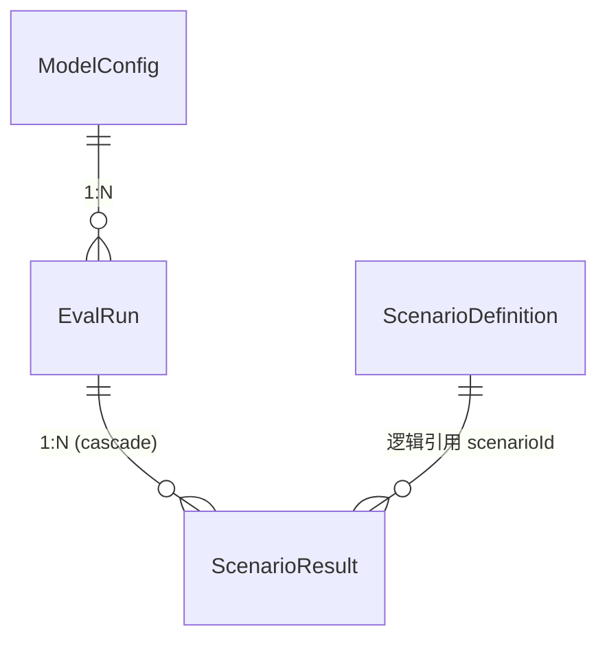

# 05 · 数据模型与存储（Prisma）

## 1. 概述

数据层使用 **Prisma 5 + SQLite**。Schema 定义在 [apps/server/prisma/schema.prisma](../../apps/server/prisma/schema.prisma)。数据库连接串来自环境变量 `DATABASE_URL`。服务启动时启用 WAL 模式、busy_timeout 等参数优化并发写入。

共 4 张表：`ModelConfig`（模型配置）、`EvalRun`（评测运行）、`ScenarioResult`（单题结果）、`ScenarioDefinition`（题目定义）。

## 2. 表结构

### 2.1 ModelConfig — 模型配置

[schema.prisma](../../apps/server/prisma/schema.prisma#L16-L29)

| 字段 | 类型 | 说明 |
| --- | --- | --- |
| id | String (uuid) | 主键 |
| name | String | 模型名称（同时作为 API `model` 参数） |
| provider | String | `openai` / `ollama` / `local` |
| baseUrl | String | OpenAI 兼容接口地址 |
| apiKey | String? | **加密存储**（AES-256-CBC，见后端文档） |
| defaultParams | String | JSON：`ModelParams`（temperature/topP/maxTokens/timeout 等） |
| modelType | String | 默认 `tested`；`judge` 表示用作 AI Judge 的模型 |
| reasoningModel | Boolean | 推理模型标记（QwQ/DeepSeek-R1），自动分配更大 token 预算 |
| createdAt / updatedAt | DateTime | 审计时间 |

### 2.2 EvalRun — 评测运行

[schema.prisma](../../apps/server/prisma/schema.prisma#L33-L50)

| 字段 | 类型 | 说明 |
| --- | --- | --- |
| id | String (uuid) | 主键 |
| name | String | 运行名称 |
| status | String | `pending / running / paused / completed / failed / cancelled` |
| modelConfigId | String | 关联模型（FK → ModelConfig） |
| config | String | JSON：`EvalRunConfig`（maxTokens、runsPerQuestion、judgeEnabled、parallelism 等） |
| manifest | String? | JSON：`RunManifest`（固化配置/题目版本） |
| summary | String? | JSON：`EvalSummary`（总分、维度均分） |
| reportContent | String? | Markdown：AI 生成的评测报告 |
| parentRunId | String? | 父运行 ID（多维度并行分组） |
| groupName | String? | 并行组标识（同组 runs 共享，历史页按此聚合） |
| dimensionFilter | String? | JSON：限定维度列表（null = 全维度） |
| createdAt / updatedAt | DateTime | 时间审计 |

关系：`modelConfig ModelConfig`、`results ScenarioResult[]`（级联删除）。

### 2.3 ScenarioResult — 单题评测结果

[schema.prisma](../../apps/server/prisma/schema.prisma#L54-L87)

| 字段 | 类型 | 说明 |
| --- | --- | --- |
| id | String (uuid) | 主键 |
| evalRunId | String | FK → EvalRun（onDelete: Cascade） |
| scenarioId | String | 题目 ID |
| scenarioVersion / scenarioHash | String | 题目版本固化 |
| dimension | String | 维度 |
| modelOutput | String | 模型输出全文 |
| reasoningContent | String? | 分离的思考链 |
| outputMetadata | String | JSON：`OutputMetadata`（截断标记、token 统计、nativeTokensPerSecond、retryBudgets 等） |
| formatParseSuccess | Boolean | 格式解析是否成功 |
| axisScores | String | JSON：`Record<dimension, score>` 分轴得分 |
| totalScore | Int | 最终总分 |
| deterministicScore / judgeScore | Int? | 确定性 / Judge 得分 |
| safetyLevel | String | `safe` / `red_line` |
| localJudge / frontierJudge / finalJudge | String? | JSON：双层裁决各层结果 |
| escalated | Boolean | 是否发生升级复核 |
| runCount | Int | 多轮统计轮数 |
| scoreHistory / verdictHistory | String | JSON：多轮分数 / 判定历史 |
| graderVersion | String | 评分器版本 |
| evidence | String | JSON：证据字符串数组（审计） |
| humanReviewRequired | Boolean | 是否需人工复核 |
| startedAt / finishedAt | DateTime | 时间审计 |

索引：`@@index([evalRunId])`、`@@index([scenarioId])`、`@@index([dimension])`。

### 2.4 ScenarioDefinition — 题目定义（在线管理）

[schema.prisma](../../apps/server/prisma/schema.prisma#L91-L131)

| 字段 | 类型 | 说明 |
| --- | --- | --- |
| id | String | 主键（非自动，来源于数据文件） |
| dimension / category / difficulty / language / locale | String | 题目元数据 |
| status | String | `valid / invalid / ambiguous / needs_context / retired` |
| tier | String | `public_dev / private_validation / blind_holdout` |
| promptTemplate | String | 支持 `{{variable}}` 参数化 |
| sourceCode / functionName / expectedVerdict | String? | 源码与期望判定 |
| grader / graderVersion | String | 评分器名称与版本 |
| scoring | String | JSON：`ScoringConfig` |
| hiddenTests | String? | JSON：`HiddenTestCase[]` |
| requirements / tags | String? | JSON |
| scenarioVersion / scenarioHash | String | 版本与哈希 |
| responseMode | String? | plan / simulated_actions / live_execution / raw_output |
| outputPolicy | String? | raw_only / fenced_allowed |
| toolSchema / expectedState / requiredInvariants / allowedActions / forbiddenActions / requiredOrder | String? | JSON：工具与安全约束 |
| environmentImage | String? | 容器/环境镜像 |
| seed | String? | 参数生成种子 |
| goldSource / goldVerifiedAt | String? / DateTime? | 金标准溯源 |
| reviewStatus | String | `unreviewed / verified / disputed` |
| createdAt / updatedAt | DateTime | 时间审计 |

索引：`@@index([dimension])`、`@@index([status])`。

## 3. 表关系

> `ScenarioResult.scenarioId` 与 `ScenarioDefinition.id` 是逻辑关联（无物理外键），题目可独立导入。

## 4. 存储与数据来源

- 数据库文件：由 `DATABASE_URL` 指向的 SQLite 文件。
- **WAL 模式**：`enableWAL()` 在服务启动时设置（[index.ts](../../apps/server/src/index.ts#L25-L38)），防止写入锁阻塞。
- 题目数据来源两条路径：
  1. `/api/migrate/pack` 从 `zxbench.pack.json`（Pack tar.gz）安装导入；
  2. 静态 JSON 目录 `data/scenarios/*.json`，由脚本导入（如 [scripts/seed-cr2.mjs](../../scripts/seed-cr2.mjs)）。

## 5. 数据一致性设计

- **断点续跑**：`ScenarioResult` 已存在的 scenarioId 会被跳过；统计时按 scenarioId 去重，避免重试产生的重复行虚高计数。
- **孤儿运行恢复**：服务重启后 `EvalRun.status='running'` 且无内存控制器的记录会被标记为 `failed`（启动时执行）。
- **运行快照**：manifest / summary / outputMetadata / judge 结果均以 JSON 字符串持久化，保证审计可回溯。