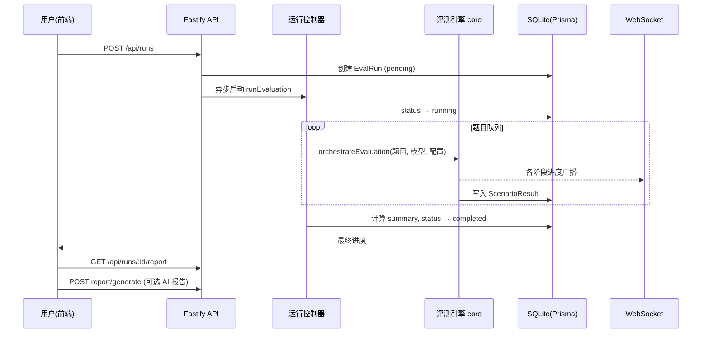

# 08 · 关键业务流程

## 1. 评测生命周期总览

## 2. 创建评测 → 后台执行

入口 `POST /api/runs`（[routes/index.ts](../../apps/server/src/routes/index.ts#L464-L532)）：
1. 校验模型配置存在、解析 `EvalRunConfig`。
2. 创建 `EvalRun`（`pending`），写入 config / manifest。
3. 异步调用 [runEvaluation()](../../apps/server/src/routes/index.ts#L2292-L2296)，设置状态 `running`。

执行循环要点：
- **题目来源**：DB 中 `status='valid'` 的 `ScenarioDefinition`，可按 `dimensionFilter` 过滤（[routes/index.ts](../../apps/server/src/routes/index.ts#L2331-L2340)）。
- **断点续跑**：读取已存在的 `ScenarioResult.scenarioId` 集合，跳过已完成题目（[routes/index.ts](../../apps/server/src/routes/index.ts#L2344-L2354)）。
- **并行模式**（`config.parallelMode`）：
  - `global`（默认）：维度交叉全局轮转队列，N 个 worker 共享队列；
  - `per_dimension`：每维度独立队列 + 独立 worker，全维度同时推进（[routes/index.ts](../../apps/server/src/routes/index.ts#L2474-L2508)）。
- **并发度**：`min(config.parallelism || 4, pendingScenarios.length)`。
- 每题完成：写 `ScenarioResult`、更新维度统计、累计 token、广播进度（[routes/index.ts](../../apps/server/src/routes/index.ts#L2604-L2664)）。

## 3. 单题评测 11 阶段（引擎内部）

见 [04-core-engine.md](./04-core-engine.md#2-编排器-orchestratorts核心流程)。关键分支：

- **推理模型空输出处理**：`finish_reason=length` 时按 `16384 → 32768 → 65536` 升级 maxTokens 重试；重试耗尽返回 `empty_response` 0 分结果（[orchestrator.ts](../../packages/core/src/orchestrator.ts#L92-L161)）。
- **思考约束（反拖尾）**：运行/题目级配置 `constraints`（`answerFirst`、`maxReasoningTokens`、`maxAnswerTokens`、`hardTimeLimitMs`、`onLimit`）后，约束以指令注入 prompt（软），同时引擎硬校验：超时或预算耗尽且无有效输出 → 构造 `reasoning_limit` 结果（0 分 / 降权 / 标记人工复核），不再无限升级预算。
- **格式盲区判定**：确定性极低但有实质输出 / 代码未用代码块包裹 / JSON 解析失败 → 调高 AI Judge 权重（det 0.3 / judge 0.7），避免“格式问题”被误判为“能力问题”（[orchestrator.ts](../../packages/core/src/orchestrator.ts#L216-L266)）。
- **评分合并**：`totalScore = deterministicScore × w_det + judgeScore × w_judge`（按 `getJudgeWeights` 各维度权重）。
- **安全红线**：触发红线 → totalScore=0 + `safetyLevel='red_line'`（[orchestrator.ts](../../packages/core/src/orchestrator.ts#L232-L245)）。

## 4. 暂停 / 恢复 / 取消

通过 `evalControllers` Map + `checkPause` 协作（[routes/index.ts](../../apps/server/src/routes/index.ts#L213-L280)）：

- **暂停**：`pauseEvaluation` 置 `paused`；执行循环在每题间 `checkPause` 时 await `resumePromise` 阻塞。
- **恢复**：`resumeEvaluation` 置 `running` 并 resolve，唤醒循环。
- **取消**：置 `cancelled` 并 resolve；循环返回 `'cancelled'` 终止，状态写 `cancelled`。
- 幂等保护：仅 `running` 可暂停、仅 `paused` 可恢复。

## 5. 并行维度分组与 fork

- **group**：多个运行共享 `groupName`（历史页聚合），每个子运行带 `dimensionFilter` 只跑部分维度。
- **fork**：`POST /api/runs/:id/fork` 从已有运行创建维度分叉子运行并合并到同一组（[routes/index.ts](../../apps/server/src/routes/index.ts#L652-L746)）。
- 前端 [EvalLive.tsx](../../apps/web/src/pages/EvalLive.tsx) 实时监控页同时拉取本 run 与同组运行进度（`/api/runs/:id/group-progress`），并合并 `currentScenarios` / `activeDimensions` 展示。

## 6. 实时进度推送

1. 执行循环构造 `EvalProgress` → `broadcastProgress`（[ws/index.ts](../../apps/server/src/ws/index.ts#L80-L99)）。
2. 服务端缓存到 `latestProgressMap`，按订阅 runId 过滤推送给 WS 连接。
3. 前端 [EvalLive.tsx](../../apps/web/src/pages/EvalLive.tsx#L139-L256)：WS 收实时消息；断线重连（指数退避 ≤5 次）；REST `/api/runs/:id/progress` 兜底；pong/ping 心跳保活。

## 7. 报告生成

### 7.1 结构化报告（GET `/api/runs/:id/report`）

聚合该 run（及同组）结果：
- 维度均分：`computeDifficultyWeightedDimAvgs`（难度加权，见 [routes/index.ts](../../apps/server/src/routes/index.ts#L110-L146)）。
- 加权总分：`computeWeightedTotal`（维度权重，program 0.32 最高）。
- 通过率（总分 ≥ 60 视为通过）、红线统计、分数分布、token 统计。

### 7.2 AI 报告（POST `/api/runs/:id/report/generate`）

将报告聚合数据打包为 `ReportUserPromptData`，调用引擎 `generateReport`（[packages/core/src/report/index.ts](../../packages/core/src/report/index.ts)），生成 Markdown 存回 `EvalRun.reportContent`，前端用 [MarkdownRenderer.tsx](../../apps/web/src/components/MarkdownRenderer.tsx) 渲染。

### 7.3 模型对比报告（POST `/api/reports/compare`）

选择多个模型 → `generateCompareReport` 产出对比维度分析，前端 [CompareModels.tsx](../../apps/web/src/pages/CompareModels.tsx) 展示并持久化历史。

## 8. 排行榜

`GET /api/leaderboard`：对已完成运行按模型聚合，结合报告统计排序，展示各维度得分与总体排名（[routes/index.ts](../../apps/server/src/routes/index.ts#L1956-L2055)）。前端 [Leaderboard.tsx](../../apps/web/src/pages/Leaderboard.tsx) 渲染排名表与报告入口。

## 9. 数据安全链路（导入/导出）

- **Pack 导入**（`/api/migrate/pack`）：URL 下载前 `validateUrlSafety`（DNS/SSRF 校验）→ 解包 → `checkPathTraversal`/`checkSymlinks` → `loadScenariosFromStaticData` → 写库（[routes/index.ts](../../apps/server/src/routes/index.ts#L1179-L1363)）。
- **导出**（`/api/runs/:id/export`）：经 `maskSensitiveData` 脱敏后输出。

## 10. 服务重启恢复

- 启动时把所有 `status='running'` 且无内存控制器的孤儿运行标记为 `failed`（[index.ts](../../apps/server/src/index.ts#L91-L114)）。
- 用户可在历史页对这些运行重新发起评测或查看已完成的 `ScenarioResult`（断点续跑会在下次运行时跳过已完成题目）。